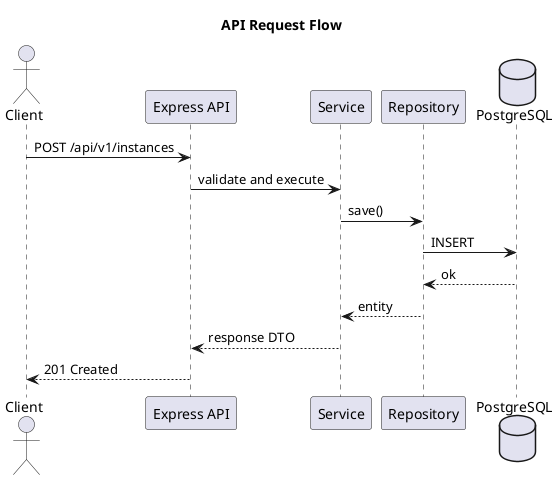

# Diagramas con PlantUML

Este proyecto incorpora el skill `plantuml-diagram-generator` para crear diagramas tecnicos reutilizables.

## Cuando usarlo

- Diagramas de arquitectura general.
- Flujo de requests API.
- Relacion entre servicios y repositorios.
- Secuencias de eventos (HTTP, MQTT, persistencia).

## Recomendaciones

- Crear un archivo `.puml` por diagrama.
- Nombrar por contexto: `api-request-flow.puml`, `mqtt-ingestion-sequence.puml`.
- Mantener una leyenda corta y titulos claros.
- Versionar los `.puml` junto al codigo que describen.

## Estructura sugerida

- `docs/diagrams/architecture/`
- `docs/diagrams/sequences/`
- `docs/diagrams/domain/`

## Ejemplo minimo

